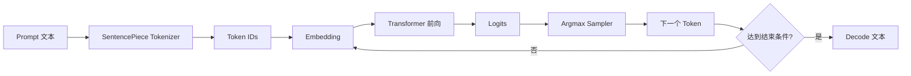
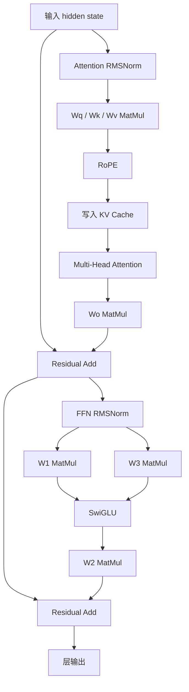
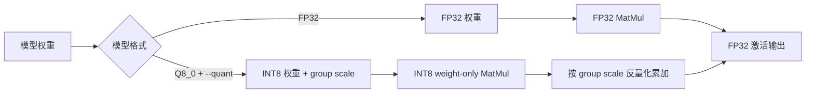
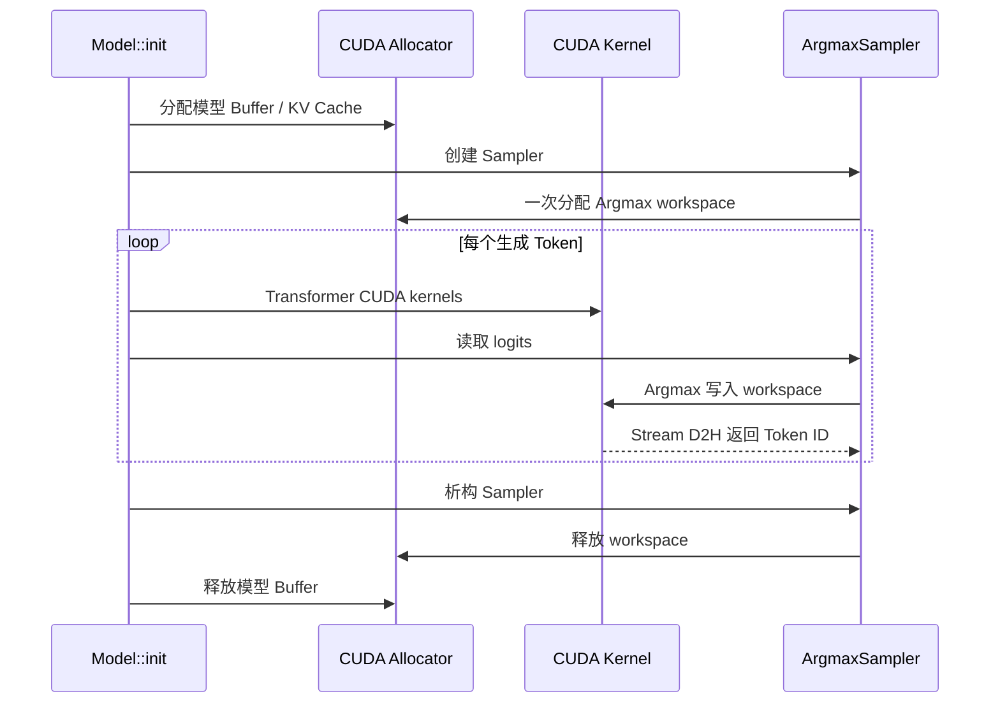
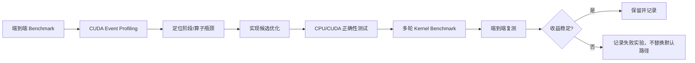

# 推理引擎架构与数据流

## 1. 端到端推理流程



程序入口是 `demo/main.cpp`。每次生成会输出生成 Token 数、TTFT、Decode 延迟、总耗时和 tokens/s。

## 2. Transformer 单层



Decode 时，历史 Token 的 K/V 保存在 KV Cache；当前 Token 只追加新的 K/V，避免重新计算历史状态。

## 3. FP32 与 Q8_0 权重路径



Q8_0 转换使用 group-size 64：

```text
scale = max(abs(weight_group)) / 127
quant = round(weight_group / scale)
```

Q8_0 只压缩 MatMul 权重；Embedding、RMSNorm 和 KV Cache 仍使用 FP32。

## 4. CUDA 与资源生命周期



Argmax workspace 复用避免了 Decode 热路径中的逐 Token `cudaMalloc`。

## 5. 性能分析闭环



当前实测主优化是 Q8_0 weight-only quantization；SwiGLU、RMSNorm 和 MatMul 的候选 Kernel 也保留为可复现实验，但没有因为微小或不稳定的差异而替换默认实现。
